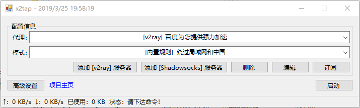
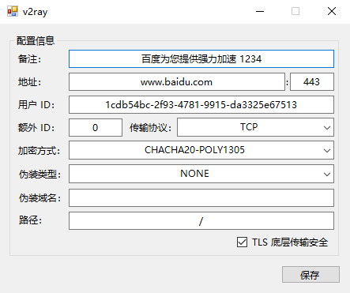
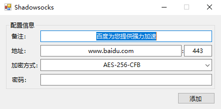
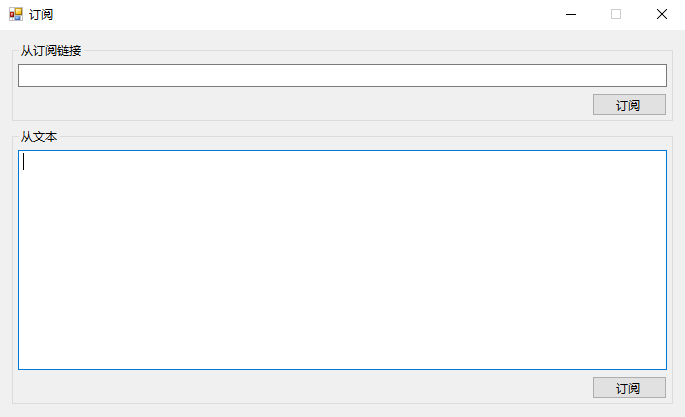

# x2tap
基于 TUN/TAP、tun2socks、v2ray 实现的 VPN 工具

**第一个版本已发布于 [releases](https://github.com/hacking001/x2tap/releases) 中**

支持 Shadowsocks 和 VMess 协议的代理（通过 v2ray 实现）
# TODO
- [x] 导入订阅（Shadowsocks、VMess）
- [x] 流量信息显示（通过 v2ray gRPC API 获取的）
- [ ] C# tun2socks
- [ ] 外置规则列表
- [ ] 本地 DNS 代理

# 依赖
- [TAP-Windows](https://build.openvpn.net/downloads/releases/latest/tap-windows-latest-stable.exe)
- [v2ray-core](https://github.com/v2ray/v2ray-core/releases)
- [tun2socks](https://github.com/hacking001/x2tap/tree/master/binaries/)

# 截图

